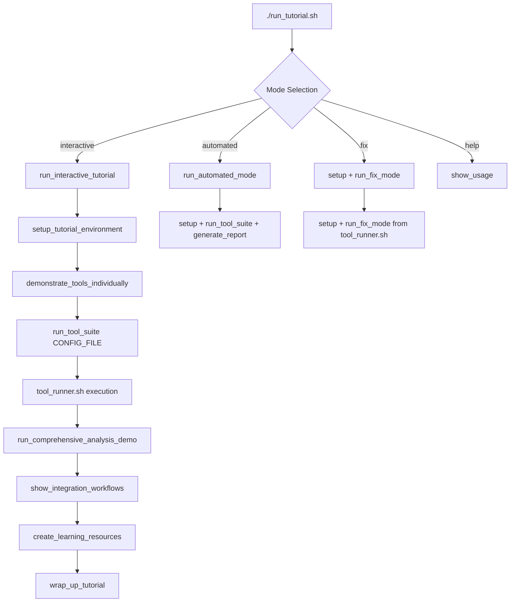

# 🎓 Main Tutorial Script - Interactive Code Walkthrough

This document provides a comprehensive walkthrough of the main `run_tutorial.sh` script, showing how it orchestrates the entire tutorial experience using our modular `tool_runner.sh` system.

---

## 🎯 **Script Overview**

The `run_tutorial.sh` script is the **orchestrator** that creates a complete educational experience. It:

- **🎭 Manages multiple execution modes** (interactive, automated, fix-only)
- **🏗️ Sets up the tutorial environment** (virtual env, dependencies)
- **📚 Provides educational content** (examples, explanations, best practices)
- **🔧 Demonstrates tool integration** (CI/CD, pre-commit, IDE setup)
- **📊 Generates learning resources** (guides, cheat sheets, templates)

---

## 🏗️ **Section 1: Script Foundation & Module Integration**

```bash
#!/bin/bash

# Python Code Quality Tools Interactive Tutorial Runner
# Modular, extensible tutorial system for code quality tools

set -e  # Exit on any error

# Get script directory for relative paths
SCRIPT_DIR="$(cd "$(dirname "${BASH_SOURCE[0]}")" && pwd)"

# Source the helper modules
source "$SCRIPT_DIR/lib/tutorial_helpers.sh"  # Formatting, logging, utilities
source "$SCRIPT_DIR/lib/tool_runner.sh"       # Tool execution engine

# Configuration
CONFIG_FILE="$SCRIPT_DIR/config/tools.conf"   # Tool definitions
TUTORIAL_MODE="${1:-interactive}"             # Default to interactive mode
```

### 🔍 **Foundation Elements**

- **🛡️ Error Handling**: `set -e` ensures script exits on any command failure
- **📁 Dynamic Paths**: Works from any directory using `SCRIPT_DIR`
- **🔗 Module Integration**: Sources both helper libraries we built
- **⚙️ Configuration-Driven**: Points to centralized tool configuration
- **🎛️ Mode Selection**: Supports different execution modes via parameter

---

## 🎭 **Section 2: The Main Tutorial Orchestrator**

```bash
# Main tutorial orchestrator
run_interactive_tutorial() {
    print_header "🚀 Python Code Quality Tools Tutorial"
    log_info "Master the essential tools for writing secure, maintainable Python code!"
    
    print_subheader "Tools covered"
    log_info "bandit (security), flake8 (style), black (formatting)"
    log_info "mypy (types), isort (imports), pytest (testing)"
    
    if confirm "Ready to begin?" "y"; then
        setup_tutorial_environment      # Environment preparation
        demonstrate_tools_individually  # Individual tool demos
        run_comprehensive_analysis_demo # Full suite analysis
        show_integration_workflows      # CI/CD integration examples
        create_learning_resources       # Generate guides and references
        wrap_up_tutorial               # Summary and next steps
    else
        log_info "Tutorial cancelled. Run again when ready!"
    fi
}
```

### 🎯 **Tutorial Flow Architecture**

The tutorial follows a **progressive learning approach**:

1. **🏗️ Environment Setup**: Ensures clean, working environment
2. **🔍 Individual Demonstrations**: Shows each tool's unique capabilities
3. **🚀 Comprehensive Analysis**: Demonstrates tools working together
4. **🔧 Integration Examples**: Real-world workflow integration
5. **📚 Resource Generation**: Creates reference materials
6. **🎉 Wrap-up**: Summary and next steps

### 💡 **Design Principles**

- **👤 User-Centered**: Confirms user readiness before proceeding
- **📈 Progressive Complexity**: Builds from simple to advanced concepts
- **🔄 Interactive Flow**: User can stop at any point
- **📖 Educational Focus**: Each phase teaches specific concepts

---

## 🏗️ **Section 3: Environment Setup - The Foundation**

```bash
# Environment setup with virtual environment
setup_tutorial_environment() {
    print_subheader "Environment Setup"
    
    start_timer
    
    # Load configuration
    load_config "$CONFIG_FILE"
    
    # Setup virtual environment and install tools
    setup_venv "$VENV_NAME" "$REQUIREMENTS_FILE"
    
    # Verify all tools are working
    log_step "Verifying tool installation"
    for tool in bandit flake8 black mypy isort pytest; do
        if check_command "$tool"; then
            local version=$(get_tool_version "$tool")
            log_success "$tool v$version installed"
        else
            log_error "Failed to install $tool"
            exit 1
        fi
    done
    
    end_timer "Environment setup"
}
```

### 🎯 **Environment Setup Process**

1. **⚙️ Configuration Loading**: `load_config()` reads from `config/tools.conf`
2. **🐍 Virtual Environment**: `setup_venv()` creates isolated Python environment
3. **📦 Dependency Installation**: Installs tools from `requirements.txt`
4. **✅ Verification Loop**: Confirms each tool is installed and working
5. **📊 Version Reporting**: Shows installed versions for debugging
6. **⏱️ Performance Tracking**: Times the entire setup process

### 💡 **Robust Error Handling**

- **🔍 Individual Tool Checks**: Each tool verified separately
- **📝 Detailed Logging**: Success/failure clearly reported  
- **🛑 Fail-Fast Approach**: Exits immediately if any tool fails
- **🔧 Actionable Errors**: Clear indication of what went wrong

---

## 🔍 **Section 4: Individual Tool Demonstrations**

```bash
# Individual tool demonstrations
demonstrate_tools_individually() {
    print_header "Individual Tool Demonstrations"
    
    log_info "Each tool will be demonstrated with intentionally problematic code"
    log_info "This shows you exactly what each tool catches and fixes"
    
    # Show bad code examples first
    show_example_files
    
    # Run each tool demo using the modular system
    run_tool_suite "$CONFIG_FILE"  # ⭐ This calls our tool_runner.sh!
}
```

### 🎓 **Educational Approach**

The script uses **"bad code examples"** as learning tools:

```bash
show_example_files() {
    print_subheader "Example Files with Issues"
    
    local example_files=(
        "examples/bandit_security_example_donot_fixme.py:Security Issues"
        "examples/flake8_style_example_donot_fixme.py:Style Violations"
        "examples/mypy_type_example_donot_fixme.py:Type Problems"
        "examples/pytest_testing_example_donot_fixme.py:Test Failures"
    )
    
    for file_info in "${example_files[@]}"; do
        IFS=':' read -r file_path description <<< "$file_info"
        
        log_step "Examining: $description"
        log_info "File: $file_path"
        
        if check_file "$file_path"; then
            echo "Preview (first 10 lines):"
            head -10 "$file_path" | nl -v 1 -s ": "
            echo "..."
        fi
        echo ""
    done
    
    if [ "$TUTORIAL_MODE" = "interactive" ]; then
        confirm "Ready to run the tools on these files?" "y"
    fi
}
```

### 🧠 **Teaching Strategy**

- **📖 Problem-First Learning**: Shows problematic code before running tools
- **🔍 Preview System**: Displays file snippets for context
- **🎯 Targeted Examples**: Each file demonstrates specific tool capabilities
- **⏸️ Paced Learning**: Interactive pauses for user comprehension
- **🎭 Mode-Aware**: Respects interactive vs automated execution

### ⭐ **Integration with Tool Runner**

The magic happens with this single line:
```bash
run_tool_suite "$CONFIG_FILE"  # Calls our modular tool execution system
```

This seamlessly integrates with the `tool_runner.sh` module we analyzed, providing:
- Standardized tool execution
- Intelligent result processing  
- Professional progress display
- Comprehensive result storage

---

## 🚀 **Section 5: Comprehensive Analysis Demo**

```bash
# Comprehensive analysis demonstration
run_comprehensive_analysis_demo() {
    print_header "Comprehensive Analysis Demo"
    
    log_info "Running all tools together on the example codebase"
    log_step "This simulates a real-world code review process"
    
    # Generate comprehensive report
    generate_report "analysis_output/comprehensive_report.md"
    
    log_success "Analysis complete! Check analysis_output/ directory"
    
    if [ "$TUTORIAL_MODE" = "interactive" ]; then
        log_info "Key findings:"
        
        # Show summary of major issues found
        for tool in "${TOOL_ORDER[@]}"; do
            local result="${TOOL_RESULTS[$tool]}"
            local status=$(echo "$result" | cut -d'|' -f1)
            local details=$(echo "$result" | cut -d'|' -f2-)
            
            case "$status" in
                "fail") log_error "$tool: $details" ;;
                "warning") log_warning "$tool: $details" ;;
                "pass") log_success "$tool: $details" ;;
            esac
        done
        
        echo ""
        confirm "Continue to see how to fix these issues?" "y"
    fi
}
```

### 🎯 **Real-World Simulation**

This function demonstrates **professional code review workflow**:

1. **📊 Batch Analysis**: Runs all tools as they would in CI/CD
2. **📝 Report Generation**: Creates professional markdown report
3. **💾 Output Organization**: Saves everything to `analysis_output/`
4. **📋 Summary Display**: Shows key findings interactively
5. **🔄 Flow Control**: User can pause to review results

### 💡 **Integration with Global State**

Notice how it accesses the global variables from `tool_runner.sh`:
- `TOOL_ORDER[]`: Maintains execution sequence
- `TOOL_RESULTS[]`: Contains all tool outputs
- These were populated by the earlier `run_tool_suite()` call

---

## 🔧 **Section 6: Integration Workflows**

```bash
# Show integration workflows and automation
show_integration_workflows() {
    print_header "Integration & Automation"
    
    create_integration_examples      # Generate real config files
    demonstrate_fix_workflow         # Show auto-fix capabilities  
    show_ci_cd_integration          # Explain CI/CD patterns
}
```

### 📁 **Real Configuration Generation**

The script creates **actual, usable configuration files**:

```bash
create_integration_examples() {
    print_subheader "Creating Integration Examples"
    
    local examples_dir="$OUTPUT_DIR/integration_examples"
    mkdir -p "$examples_dir"
    
    # Pre-commit configuration
    create_precommit_config "$examples_dir"
    
    # GitHub Actions workflow  
    create_github_actions_workflow "$examples_dir"
    
    # Makefile for common tasks
    create_project_makefile "$examples_dir"
    
    # VS Code settings
    create_vscode_settings "$examples_dir"
    
    log_success "Integration examples created in $examples_dir"
}
```

### 🛠️ **Generated Integration Files**

Each function creates **production-ready configuration**:

#### **Pre-commit Configuration**
```bash
create_precommit_config() {
    local output_dir="$1"
    
    cat > "$output_dir/.pre-commit-config.yaml" << 'EOF'
repos:
  - repo: https://github.com/psf/black
    rev: 24.1.1
    hooks:
      - id: black
        language_version: python3.8
  - repo: https://github.com/pycqa/isort
    rev: 5.13.2
    hooks:
      - id: isort
        args: ["--profile", "black"]
  - repo: https://github.com/pycqa/flake8
    rev: 7.0.0
    hooks:
      - id: flake8
        additional_dependencies: [flake8-docstrings]
  # ... more hooks
EOF
    
    log_info "Created: .pre-commit-config.yaml"
}
```

#### **GitHub Actions Workflow**
```bash
create_github_actions_workflow() {
    local output_dir="$1"
    mkdir -p "$output_dir/.github/workflows"
    
    cat > "$output_dir/.github/workflows/quality.yml" << 'EOF'
name: Code Quality

on:
  push:
    branches: [ main, develop ]
  pull_request:
    branches: [ main ]

jobs:
  quality:
    runs-on: ubuntu-latest
    strategy:
      matrix:
        python-version: [3.8, 3.9, "3.10", "3.11"]

    steps:
    - uses: actions/checkout@v4
    
    - name: Set up Python ${{ matrix.python-version }}
      uses: actions/setup-python@v4
      with:
        python-version: ${{ matrix.python-version }}
    
    - name: Install dependencies
      run: |
        python -m pip install --upgrade pip
        pip install -r requirements.txt
    
    - name: Security scan with bandit
      run: bandit -r . -f json -o bandit-report.json
      continue-on-error: true
    
    - name: Lint with flake8
      run: flake8 . --count --show-source --statistics
    
    # ... more steps
EOF
    
    log_info "Created: .github/workflows/quality.yml"
}
```

### 🎯 **Integration Patterns Taught**

- **🪝 Pre-commit Hooks**: Catch issues before commits
- **🤖 CI/CD Pipelines**: Automated quality gates  
- **⚡ Makefile Workflows**: Developer convenience commands
- **💻 IDE Configuration**: Editor integration for real-time feedback

---

## 🔧 **Section 7: Auto-Fix Demonstration**

```bash
demonstrate_fix_workflow() {
    print_subheader "Automatic Fix Demonstration"
    
    if confirm "Run auto-fix mode demonstration?" "y"; then
        run_fix_mode "$CONFIG_FILE"  # ⭐ Calls tool_runner.sh function
    else
        log_info "Skipping auto-fix demonstration"
    fi
}
```

### 💡 **Seamless Module Integration**

This demonstrates perfect **separation of concerns**:
- **🎭 Tutorial Script**: Handles UI, flow, and user interaction
- **🔧 Tool Runner**: Handles the actual fixing logic and safety measures
- **🤝 Clean Interface**: Simple function call with clear purpose

The `run_fix_mode()` function from `tool_runner.sh` provides:
- User confirmation prompts
- Automatic backup creation
- Safe formatting fixes only
- Progress reporting
- Error handling

---

## 🎛️ **Section 8: Multiple Execution Modes**

```bash
# Non-interactive mode for automated execution
run_automated_mode() {
    print_header "🤖 Automated Analysis Mode"
    
    setup_tutorial_environment
    
    log_step "Running comprehensive analysis"
    run_tool_suite "$CONFIG_FILE"
    
    log_step "Generating reports"
    generate_report
    
    log_success "Automated analysis complete"
}

# Main entry point
main() {
    case "${TUTORIAL_MODE}" in
        "interactive"|"")
            run_interactive_tutorial
            ;;
        "automated"|"auto")
            run_automated_mode
            ;;
        "fix"|"autofix")
            setup_tutorial_environment
            run_fix_mode "$CONFIG_FILE"
            ;;
        "--help"|"-h")
            show_usage
            ;;
        *)
            log_error "Unknown mode: $TUTORIAL_MODE"
            show_usage
            exit 1
            ;;
    esac
}
```

### 🎭 **Mode Flexibility**

| Mode | Usage | Purpose |
|------|-------|---------|
| **🎓 Interactive** | `./run_tutorial.sh` | Full educational experience |
| **🤖 Automated** | `./run_tutorial.sh automated` | CI/CD integration, no prompts |
| **🔧 Fix** | `./run_tutorial.sh fix` | Apply fixes only |
| **❓ Help** | `./run_tutorial.sh --help` | Usage information |

### 💡 **Mode Design Benefits**

- **🎯 Purpose-Built**: Each mode optimized for specific use cases
- **🔄 Reusable Logic**: Shares common functions between modes
- **🛡️ Error Handling**: Graceful handling of unknown modes
- **📚 Self-Documenting**: Built-in help system

---

## 🚀 **Section 9: Complete Integration Flow**

Here's how the main script orchestrates the entire system:



### 🎯 **Integration Points with Tool Runner**

The main script calls `tool_runner.sh` functions at key points:

1. **🔧 Tool Execution**: `run_tool_suite("$CONFIG_FILE")`
2. **📊 Report Generation**: `generate_report("analysis_output/report.md")`
3. **🛠️ Auto-Fix Mode**: `run_fix_mode("$CONFIG_FILE")`

### 🤝 **Perfect Module Separation**

- **🎭 Main Script Responsibilities**:
  - User interaction and flow control
  - Educational content and explanations
  - Resource generation (guides, configs)
  - Mode management and routing

- **🔧 Tool Runner Responsibilities**:
  - Tool execution and result processing
  - Progress tracking and timing
  - Report generation and formatting
  - Auto-fix safety and implementation

---

## 💡 **Section 10: Advanced Features & Customization**

### 🎛️ **Configuration Integration**

```bash
# The script loads configuration dynamically
load_config "$CONFIG_FILE"    # From tutorial_helpers.sh

# This provides access to:
# - TUTORIAL_NAME
# - VENV_NAME  
# - REQUIREMENTS_FILE
# - OUTPUT_DIR
# - TOOLS array
# - TOOL_CONFIGS
# - All threshold settings
```

### 🔄 **State Management**

The script maintains **clean state management**:

- **🌍 Global Configuration**: Loaded once, used everywhere
- **📊 Tool Results**: Populated by tool_runner.sh, accessed for summaries
- **⏱️ Timing Information**: Consistent across all operations  
- **🎛️ Mode Awareness**: Behavior adapts based on execution mode

### 🛡️ **Error Handling Strategy**

```bash
set -e                    # Exit on any error
set_error_handling        # From tutorial_helpers.sh (custom trap)

# Comprehensive error checking:
if check_command "$tool"; then
    # Success path
else
    log_error "Failed to install $tool"
    exit 1    # Fail fast with clear messaging
fi
```

---

## 🎯 **Section 11: Why This Architecture Excels**

### 🏗️ **Clean Architecture Benefits**

1. **🎭 Separation of Concerns**:
   - Main script: UI, flow, education
   - Tool runner: execution, processing
   - Helpers: utilities, formatting

2. **🔧 Modular Design**:
   - Each module has single responsibility
   - Functions are focused and reusable
   - Easy to test and maintain

3. **⚙️ Configuration-Driven**:
   - Tools defined in simple config files
   - No hardcoded tool lists in logic
   - Easy to customize and extend

4. **🎯 Mode Flexibility**:
   - Same core logic serves multiple use cases
   - Interactive learning vs automated CI/CD
   - Consistent behavior across modes

### 🚀 **Educational Excellence**

- **📚 Progressive Learning**: Builds complexity gradually
- **🎯 Problem-First**: Shows issues before solutions
- **🔧 Practical Focus**: Real-world integration examples
- **📖 Comprehensive Resources**: Leaves users with references

### 💪 **Production Ready**

- **🛡️ Robust Error Handling**: Never leaves users stranded
- **📊 Professional Output**: Clean, informative displays
- **🔄 Automated Modes**: Ready for CI/CD integration
- **⚡ Performance Aware**: Times operations, provides feedback

---

## 🎉 **Summary: A Complete Tutorial System**

The `run_tutorial.sh` script transforms what could be a simple tool demo into a **comprehensive learning experience**:

### 🎯 **What Makes It Special**

1. **🎓 Educational Design**: Every feature teaches something valuable
2. **🔧 Practical Integration**: Generates real, usable configurations
3. **🎭 Multiple Personas**: Serves beginners and CI/CD automation equally
4. **🚀 Professional Quality**: Production-ready code with robust error handling
5. **📈 Progressive Complexity**: Builds understanding step by step

### 🏆 **The Result**

- **👤 For Users**: A guided journey from beginner to expert
- **🤖 For CI/CD**: A reliable analysis tool ready for automation  
- **🔧 For Developers**: A maintainable, extensible codebase
- **📚 For Teams**: A complete resource for adopting code quality tools

The modular architecture makes complex tutorial orchestration look effortless, while the educational approach ensures users don't just run tools—they **understand and master them**! 🎯